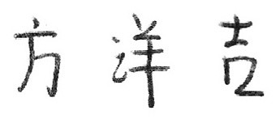
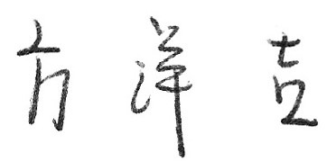
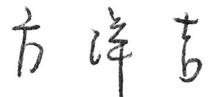
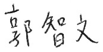
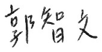

# HanSig

`HanSig` is a large-scale offline Chinese handwritten signature dataset. The `HanSig` dataset has the following characteristics:
 
1. It consists of 35,400 signature samples from 238 writers (17,700 genuine signatures and an equal number of skilled forgeries).
2. For each name, 20 genuine signatures and 20 corresponding forgeries were collected.
3. It incorporates the real-world property of intra-writer variations by collecting signatures for a specific name in three different styles.
4. The signatures cropped from the scanned images have been preprocessed by removing table lines and excess blanks around the signatures, ready for instant use. 
5. It is applicable to both random and skilled forgery verification tasks.

## Data Examples ##


- Examples of collected signatures in three styles: neat (top), normal (middle), and stylish (bottom).

</br> 
</br> 


- Examples of collected genuine (top) and forged (bottom) signatures.

</br> 


* Each genuine signature image has a unique filename such as *original\_w1\_2\_3.jpg*. This filename is organized as follows: 
  * *w1* refers to the first writer who signed this signature
  * *2* means this signature belongs to the second name
  * *3* refers to the third signature image of a specific name 
* Each forged signature image has a unique filename such as *forgery\_w1\_2\_3.jpg*. This filename is organized similar to that of genuine signature images.

## Getting the data ##

Please fill in [the form](https://docs.google.com/forms/d/e/1FAIpQLSeYeHmEF09Ek7A-idUCpKfF1PRQM85Uo1kTn1EdIj3Iw2bZNw/viewform?usp=sf_link) to obtain instructions for downloading the `HanSig` dataset. In addition, please refer to above-mentioned Data Examples and our work for detailed description of this dataset.

## Citation ##

If you use this dataset in your research, please cite our work: </br>
**Fu-Hsien Huang and Hsin-Min Lu. Multiscale Global and Regional Feature Learning Using Co-Tuplet Loss for Offline Handwritten Signature Verification.**

```
@article{multisigver2023,
  author={Huang, Fu-Hsien and Lu, Hsin-Min},
  journal={}, 
  title={Multiscale Global and Regional Feature Learning Using Co-Tuplet Loss for Offline Handwritten Signature Verification}, 
  year={},
  volume={},
  pages={},
  DOI = {}
}
```
